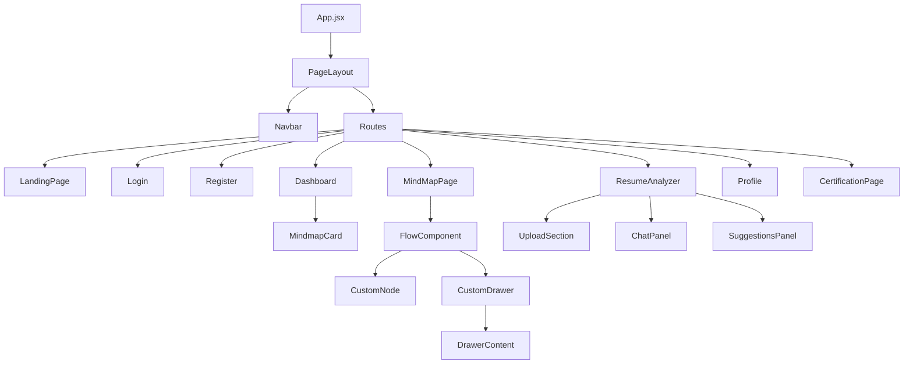
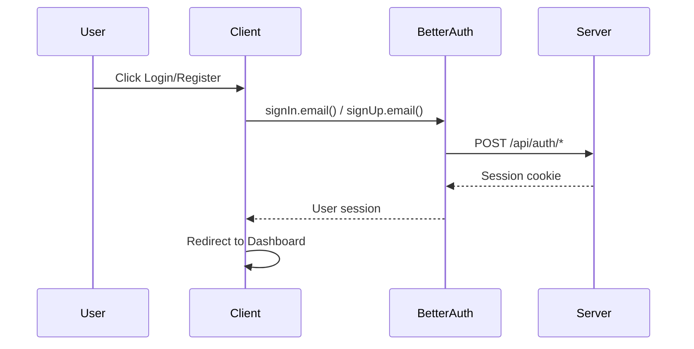

# Client Architecture (React/Vite)

> **Location**: `client/` | **Port**: 5173 | **Framework**: React + Vite

---

## 📁 Directory Structure

```
client/
├── src/
│   ├── api/                    # API communication layer
│   │   ├── axiosInstance.js    # Base axios configuration
│   │   ├── authApi.js          # Authentication API calls
│   │   ├── mindmapApi.js       # Learning path API calls
│   │   ├── resumeAgentApi.js   # Resume agent service calls
│   │   ├── resumeSessionApi.js # Session persistence calls
│   │   ├── certificationApi.js # Certification API calls
│   │   └── userApi.js          # User profile API calls
│   │
│   ├── components/             # Reusable UI components
│   │   ├── AuthComponents/     # Login/Register forms
│   │   ├── Navbar/             # Navigation bar
│   │   ├── ResumeAgent/        # Resume analysis UI
│   │   │   ├── ChatPanel.jsx   # AI chat interface
│   │   │   ├── SuggestionsPanel.jsx
│   │   │   ├── SessionHistoryPanel.jsx  # Session history sidebar
│   │   │   └── UploadSection.jsx
│   │   ├── CustomNode.jsx      # React Flow custom node
│   │   ├── FlowComponent.jsx   # React Flow wrapper
│   │   ├── DrawerContent.jsx   # Side drawer for resources
│   │   ├── MindMap.jsx         # Mindmap visualization
│   │   └── ui/                 # Base UI components (buttons, inputs)
│   │
│   ├── Pages/                  # Route-level components
│   │   ├── LandingPage.jsx     # Home page
│   │   ├── Login.jsx           # Login page
│   │   ├── Register.jsx        # Registration page
│   │   ├── Dashboard.jsx       # User dashboard
│   │   ├── MindMapPage.jsx     # Learning path viewer
│   │   ├── ResumeAnalyzer.jsx  # Resume analysis page
│   │   ├── CertificationPage.jsx
│   │   ├── Profile.jsx         # User profile
│   │   └── PageLayout.jsx      # Layout wrapper
│   │
│   ├── hooks/                  # Custom React hooks
│   │   ├── useRoadmap/         # Learning path logic hooks
│   │   │   ├── useRoadmapFlow.js
│   │   │   ├── useRoadmapNodes.js
│   │   │   └── useRoadmapDrawer.js
│   │   └── useNavbarVisibility.js
│   │
│   ├── lib/                    # Library configurations
│   │   └── auth-client.js      # Better Auth client setup
│   │
│   ├── App.jsx                 # Main app with routing
│   ├── main.jsx                # React entry point
│   └── index.css               # Global styles (Tailwind)
│
├── public/                     # Static assets
├── utils/                      # Utility functions
├── vite.config.js              # Vite configuration
└── package.json
```

---

## 🧩 Component Hierarchy



---

## 🔌 API Layer

| File | Purpose | Endpoints |
|------|---------|-----------|
| `authApi.js` | Authentication | Login, Register, Session |
| `mindmapApi.js` | Learning paths | CRUD operations, AI generation |
| `resumeAgentApi.js` | Resume AI | Upload PDF, Chat (SSE), Jobs |
| `resumeSessionApi.js` | Session persistence | Save/Load chat sessions |
| `userApi.js` | User profile | Get/Update profile |
| `certificationApi.js` | Certifications | Progress tracking |

---

## 🎣 Custom Hooks

| Hook | Purpose |
|------|---------|
| `useRoadmapFlow` | React Flow state management |
| `useRoadmapNodes` | Node creation and updates |
| `useRoadmapDrawer` | Side drawer state |
| `useNavbarVisibility` | Scroll-based navbar visibility |

---

## 🔐 Authentication Flow



---

## 📄 Pages Reference

| Page | Route | Description |
|------|-------|-------------|
| `LandingPage` | `/` | Marketing landing page |
| `Login` | `/login` | User login |
| `Register` | `/register` | User registration |
| `Dashboard` | `/dashboard` | User's saved mindmaps |
| `MindMapPage` | `/mindmap/:id` | Interactive learning path |
| `ResumeAnalyzer` | `/resume-analyzer` | AI resume analysis |
| `Profile` | `/profile` | User profile settings |
| `CertificationPage` | `/certifications` | Skill certifications |

---

## 🎨 Styling

- **Framework**: Tailwind CSS
- **Global Styles**: `src/index.css`
- **Component Styles**: CSS Modules (`.module.css`)
- **Theme**: Dark mode support via Tailwind

---

## 📦 Key Dependencies

| Package | Purpose |
|---------|---------|
| `react` | UI framework |
| `@xyflow/react` | Learning path visualization |
| `@tanstack/react-query` | Server state management |
| `better-auth/react` | Authentication client |
| `axios` | HTTP client |
| `tailwindcss` | Utility CSS |
| `lucide-react` | Icons |

---

## ✅ Adding New Features Checklist

1. [ ] Create page in `src/Pages/`
2. [ ] Add route in `App.jsx`
3. [ ] Create API functions in `src/api/`
4. [ ] Create reusable components in `src/components/`
5. [ ] Extract complex logic to `src/hooks/`
6. [ ] Update this documentation
