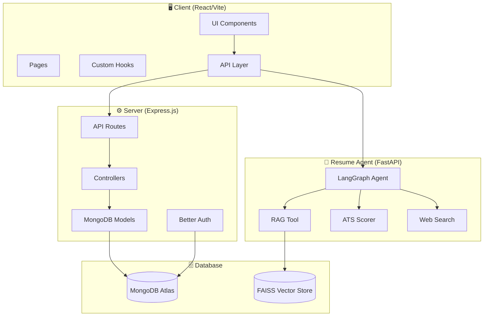

# PathGenie Project Architecture Overview

> **IMPORTANT**: Before implementing any new feature or making changes, **ALWAYS** refer to this folder first. This documentation serves as the single source of truth for understanding the project structure.

## 📁 Project Structure

```
PathGenie/
├── .agent/                      # Architecture docs & development rules
│   ├── architecture/            # Component analysis documents
│   │   ├── PROJECT_OVERVIEW.md  # This file - start here
│   │   ├── CLIENT.md            # Frontend architecture
│   │   ├── SERVER.md            # Backend architecture
│   │   └── RESUME_AGENT.md      # AI microservice architecture
│   ├── workflows/               # Development workflows
│   └── RULES.md                 # Development rules & guidelines
├── client/                      # React/Vite frontend (port 5173)
├── server/                      # Express.js backend (port 8000)
├── resume_agent_service/        # FastAPI/LangGraph AI service (port 8001)
└── README.md                    # User-facing documentation
```

---

## 🏗️ System Architecture



---

## 🔌 Service Communication

| From | To | Protocol | Purpose |
|------|-----|----------|---------|
| Client | Server | HTTP REST | Auth, Mindmaps, User data |
| Client | Resume Agent | HTTP + SSE | Resume analysis, Chat streaming |
| Server | MongoDB | MongoDB Driver | Data persistence |
| Resume Agent | FAISS | In-memory | Vector similarity search |
| Resume Agent | Groq API | HTTPS | LLM inference |

---

## 🔐 Environment Variables

### Server (.env)
| Variable | Description |
|----------|-------------|
| `PORT` | Server port (default: 8000) |
| `BETTER_AUTH_SECRET` | Auth secret key |
| `BETTER_AUTH_URL` | Auth base URL |
| `GOOGLE_CLIENT_ID` | Google OAuth client ID |
| `GOOGLE_CLIENT_SECRET` | Google OAuth secret |
| `MONGODB_URI` | MongoDB connection string |
| `CLIENT_URL` | Frontend URL (for CORS) |
| `GROQ_API_KEY` | Groq API key for AI features |

### Client (.env)
| Variable | Description |
|----------|-------------|
| `VITE_SERVER_URL` | Backend API URL |
| `VITE_CLIENT_URL` | Frontend URL |
| `VITE_RESUME_AGENT_URL` | Resume Agent service URL |
| `VITE_MODE` | development/production |

### Resume Agent Service (.env)
| Variable | Description |
|----------|-------------|
| `GROQ_API_KEY` | Groq API key for LLM |

---

## 🚀 Running the Application

```bash
# Terminal 1: Backend Server
cd server && npm start

# Terminal 2: Frontend Client
cd client && npm run dev

# Terminal 3: Resume Agent Service
cd resume_agent_service && uvicorn app.main:app --reload --port 8001
```

---

## 📊 Feature Map

| Feature | Frontend | Backend | AI Service |
|---------|----------|---------|------------|
| Authentication | `/Login`, `/Register` | `/api/auth/*` | - |
| Learning Paths | `MindMapPage`, `Dashboard` | `/api/mindmaps/*` | - |
| Resume Analysis | `ResumeAnalyzer` | `/api/resume-sessions/*` | `/upload`, `/chat` |
| User Profile | `/Profile` | `/api/user/*` | - |
| Certifications | `CertificationPage` | `/api/certifications/*` | - |

---

## 🔗 Quick Links to Component Docs

- [Client Architecture →](file:///c:/Users/PARTH/Desktop/PathGenie/.agent/architecture/CLIENT.md)
- [Server Architecture →](file:///c:/Users/PARTH/Desktop/PathGenie/.agent/architecture/SERVER.md)
- [Resume Agent Architecture →](file:///c:/Users/PARTH/Desktop/PathGenie/.agent/architecture/RESUME_AGENT.md)
- [Development Rules →](file:///c:/Users/PARTH/Desktop/PathGenie/.agent/RULES.md)
