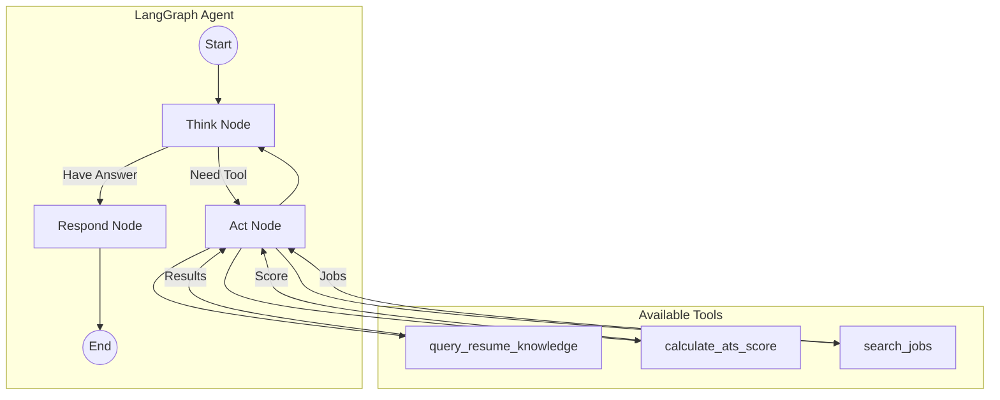
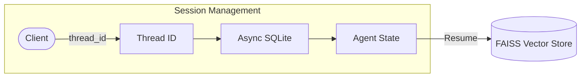
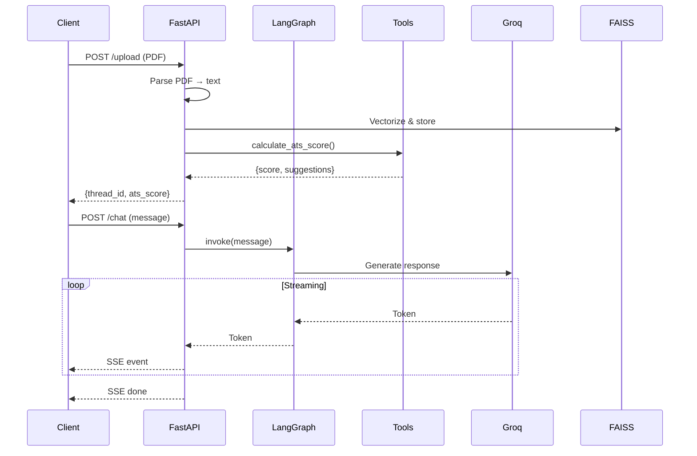

# Resume Agent Service Architecture (FastAPI/LangGraph)

> **Location**: `resume_agent_service/` | **Port**: 8001 | **Framework**: FastAPI + LangGraph

---

## 📁 Directory Structure

```
resume_agent_service/
├── app/
│   ├── main.py                 # FastAPI endpoints + SSE streaming
│   │
│   ├── core/                   # Configuration & state
│   │   ├── config.py           # Environment config
│   │   └── state.py            # LangGraph agent state schema
│   │
│   ├── graph/                  # LangGraph agent definition
│   │   ├── __init__.py
│   │   ├── builder.py          # Graph construction
│   │   └── nodes.py            # Agent nodes (think, act, respond)
│   │
│   ├── memory/                 # Session persistence
│   │   ├── checkpointer.py     # Async SQLite checkpointer
│   │   └── thread_manager.py   # Thread ID management
│   │
│   ├── services/               # Business logic
│   │   └── resume_ingestion.py # PDF parsing & vectorization
│   │
│   └── tools/                  # Agent tools
│       ├── __init__.py         # Tool exports
│       ├── rag_tool.py         # Resume RAG queries
│       ├── ats_scorer.py       # ATS compatibility scoring
│       └── web_search_tool.py  # Job search via DuckDuckGo
│
├── .env                        # Environment variables
├── requirements.txt            # Python dependencies
└── README.md
```

---

## 🤖 LangGraph Agent Architecture



---

## 🔌 API Endpoints

### `POST /upload`
Upload and process a PDF resume.

**Request:**
```json
{
  "file": "<PDF binary>",
  "thread_id": "optional-existing-thread-id"
}
```

**Response:**
```json
{
  "success": true,
  "thread_id": "abc123",
  "message": "Resume processed successfully",
  "ats_score": 75,
  "suggestions": ["Add more keywords", "Improve formatting"]
}
```

---

### `POST /chat` (SSE Streaming)
Chat with the AI about the resume.

**Request:**
```json
{
  "thread_id": "abc123",
  "message": "What jobs match my skills?"
}
```

**Response:** Server-Sent Events (SSE)
```
data: {"type": "token", "content": "Based"}
data: {"type": "token", "content": " on"}
data: {"type": "token", "content": " your"}
...
data: {"type": "done", "content": ""}
```

---

### `GET /health`
Health check endpoint.

**Response:**
```json
{
  "status": "healthy"
}
```

---

## 🧠 Agent State Schema

```python
class AgentState(TypedDict):
    messages: Annotated[list, add_messages]  # Chat history
    resume_text: str                          # Parsed resume content
    ats_score: Optional[int]                  # ATS compatibility score
    thread_id: str                            # Session identifier
```

---

## 🔧 Tools Reference

### `query_resume_knowledge`
RAG tool to search the vectorized resume content.

```python
def query_resume_knowledge(query: str, thread_id: str) -> str:
    """
    Search the resume for relevant information.
    Uses FAISS vector store for semantic search.
    """
```

### `calculate_ats_score`
Analyze resume for ATS compatibility.

```python
def calculate_ats_score(resume_text: str) -> dict:
    """
    Returns:
    - score: 0-100 ATS compatibility score
    - suggestions: List of improvement recommendations
    - keyword_analysis: Missing/present keywords
    """
```

### `search_jobs`
Search for matching job opportunities.

```python
def search_jobs(skills: list[str], location: str = "") -> list[dict]:
    """
    Uses DuckDuckGo to find job listings.
    Returns: List of job objects with title, company, url
    """
```

---

## 💾 Memory & Persistence



### Thread Management
- Each resume upload creates a new `thread_id`
- Thread ID links: chat history, resume vectors, ATS score
- SQLite checkpointer persists LangGraph state
- FAISS stores resume embeddings per thread

---

## 📊 Data Flow



---

## 📦 Key Dependencies

| Package | Purpose |
|---------|---------|
| `fastapi` | Web framework |
| `langgraph` | Agent orchestration |
| `langchain` | LLM utilities |
| `langchain-groq` | Groq LLM integration |
| `faiss-cpu` | Vector similarity search |
| `pypdf2` | PDF text extraction |
| `duckduckgo-search` | Web search |
| `sse-starlette` | Server-sent events |

---

## ✅ Adding New Features Checklist

1. [ ] **New Tool**: Add to `app/tools/`, export in `__init__.py`, bind to agent in `builder.py`
2. [ ] **New Endpoint**: Add to `app/main.py`
3. [ ] **State Changes**: Update `core/state.py`, adjust nodes in `graph/nodes.py`
4. [ ] **New Node**: Add to `graph/nodes.py`, wire in `graph/builder.py`
5. [ ] Update this documentation

---

## 🐛 Debugging Tips

1. **Check logs**: All LangGraph nodes log to console
2. **Test tools independently**: Import and call tools directly
3. **Inspect state**: Use `checkpointer.get()` to view saved state
4. **Streaming issues**: Check SSE connection in browser DevTools
