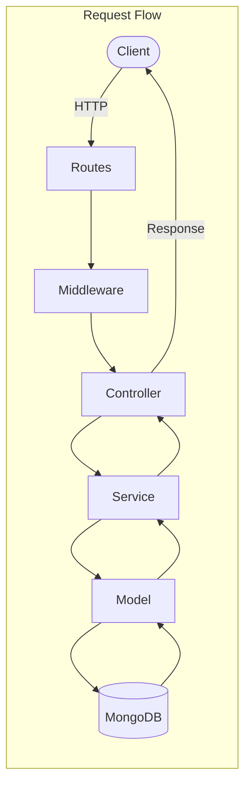
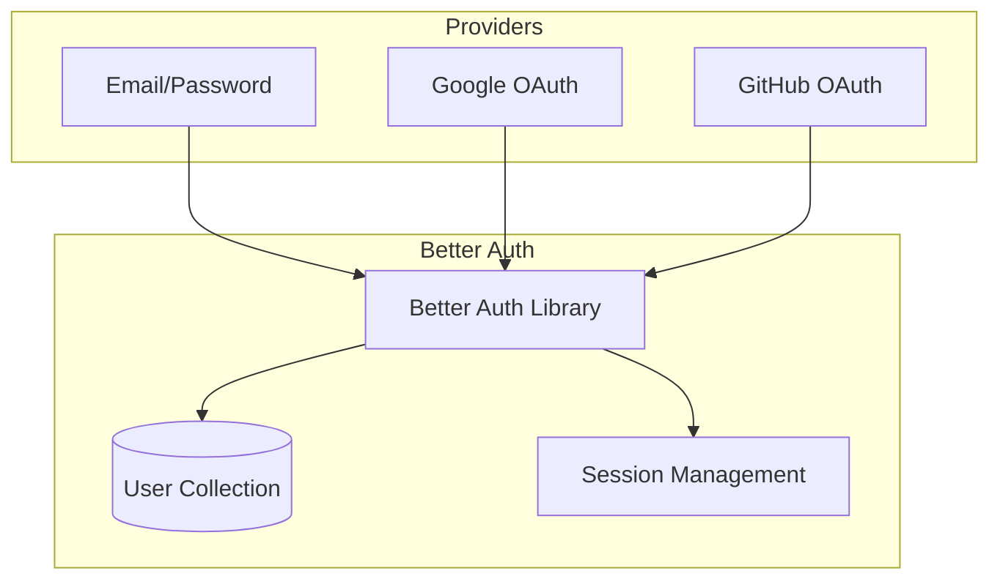

# Server Architecture (Express.js/Node.js)

> **Location**: `server/` | **Port**: 8000 | **Framework**: Express.js

---

## 📁 Directory Structure

```
server/
├── config/
│   └── config.js               # Environment configuration
│
├── controllers/                # Request handlers
│   ├── mindmapController.js    # Learning path logic
│   ├── userController.js       # User profile logic
│   ├── resumeSessionController.js  # Resume session CRUD
│   └── certificationController.js  # Certification logic
│
├── db/
│   └── db.js                   # MongoDB connection
│
├── lib/
│   └── auth.js                 # Better Auth configuration
│
├── middlewares/
│   ├── authMiddleware.js       # Auth verification
│   └── errorHandler.js         # Global error handling
│
├── models/                     # Mongoose schemas
│   ├── MindMap.model.js        # Learning path schema
│   ├── Node.model.js           # Mindmap node schema
│   ├── Profile.model.js        # User profile schema
│   └── ResumeSession.model.js  # Resume analysis session
│
├── routes/                     # API route definitions
│   ├── protectedRoutes.js      # Route aggregator
│   ├── mindmapRoutes.js        # /api/mindmaps/*
│   ├── userRoutes.js           # /api/user/*
│   └── resumeSessionRoutes.js  # /api/resume-sessions/*
│
├── services/                   # Business logic layer
│   ├── mindmapService.js       # Mindmap operations
│   └── groqService.js          # Groq AI integration
│
├── utils/                      # Utilities
│   ├── logger.js               # Winston logger
│   ├── prompts.js              # AI prompt templates
│   └── asyncHandler.js         # Async error wrapper
│
├── app.js                      # Express app setup
├── index.js                    # Server entry point
├── constants.js                # App constants
└── package.json
```

---

## 🏛️ MVC Architecture



---

## 🛣️ API Routes

### Authentication (`/api/auth/*`)
Handled by Better Auth library automatically.

| Method | Endpoint | Description |
|--------|----------|-------------|
| POST | `/api/auth/sign-up/email` | Register with email |
| POST | `/api/auth/sign-in/email` | Login with email |
| POST | `/api/auth/sign-in/social` | OAuth login (Google/GitHub) |
| GET | `/api/auth/get-session` | Get current session |
| POST | `/api/auth/sign-out` | Logout |

### Mindmaps (`/api/mindmaps/*`)

| Method | Endpoint | Description |
|--------|----------|-------------|
| GET | `/api/mindmaps` | Get user's mindmaps |
| GET | `/api/mindmaps/:id` | Get specific mindmap |
| POST | `/api/mindmaps` | Create new mindmap |
| PUT | `/api/mindmaps/:id` | Update mindmap |
| DELETE | `/api/mindmaps/:id` | Delete mindmap |
| POST | `/api/mindmaps/generate` | AI-generate learning path |

### User (`/api/user/*`)

| Method | Endpoint | Description |
|--------|----------|-------------|
| GET | `/api/user/profile` | Get user profile |
| PUT | `/api/user/profile` | Update user profile |

### Resume Sessions (`/api/resume-sessions/*`)

| Method | Endpoint | Description |
|--------|----------|-------------|
| GET | `/api/resume-sessions` | Get all sessions |
| GET | `/api/resume-sessions/:id` | Get specific session |
| POST | `/api/resume-sessions` | Create new session |
| PUT | `/api/resume-sessions/:id` | Update session |
| DELETE | `/api/resume-sessions/:id` | Delete session |

---

## 📊 Data Models

### MindMap
```javascript
{
  userId: ObjectId,
  title: String,
  description: String,
  nodes: [Node],
  edges: [Edge],
  createdAt: Date,
  updatedAt: Date
}
```

### Node
```javascript
{
  mindmapId: ObjectId,
  type: String,
  position: { x: Number, y: Number },
  data: {
    label: String,
    description: String,
    resources: [Resource]
  }
}
```

### Profile
```javascript
{
  userId: ObjectId,
  bio: String,
  createdAt: Date
}
```

### ResumeSession
```javascript
{
  sessionId: String,         // Thread ID for LangGraph
  userId: ObjectId,
  resumeText: String,
  atsScore: Number,
  messages: [{
    role: String,            // 'user' | 'assistant'
    content: String,
    timestamp: Date
  }],
  createdAt: Date,
  updatedAt: Date
}
```

---

## 🔐 Authentication (Better Auth)



### Configuration (`lib/auth.js`)
- MongoDB adapter for user storage
- Database hooks for profile creation
- Social providers: Google, GitHub
- Trusted origins for CORS

---

## 🔄 Middleware Stack

```javascript
// Order of middleware in app.js
app.use(rateLimit);           // Rate limiting
app.use(requestLogger);       // Log all requests
app.use(morgan);              // HTTP logging
app.use(cors);                // CORS headers
app.all('/api/auth/*', auth); // Better Auth
app.use(express.json);        // JSON parsing
app.use(cookieParser);        // Cookie parsing
app.use('/api', protectedRoutes);  // API routes
app.use(errorHandler);        // Error handling
```

---

## ⚙️ Configuration

### Environment Variables (`config/config.js`)
```javascript
{
  port: process.env.PORT,
  db: { uri: process.env.MONGODB_URI },
  betterAuth: {
    google: { clientId, clientSecret },
    github: { clientId, clientSecret }
  }
}
```

### Constants (`constants.js`)
```javascript
{
  dbName: 'pathGenieDB',
  morganFormat: ':method :url :status :response-time ms',
  clientUrl: process.env.CLIENT_URL,
  serverUrl: process.env.SERVER_URL
}
```

---

## ✅ Adding New Features Checklist

1. [ ] Create model in `models/` with Mongoose schema
2. [ ] Create controller in `controllers/` with handlers
3. [ ] Create route in `routes/` mapping endpoints to handlers
4. [ ] Register route in `routes/protectedRoutes.js`
5. [ ] Add service layer if complex business logic needed
6. [ ] Update this documentation
