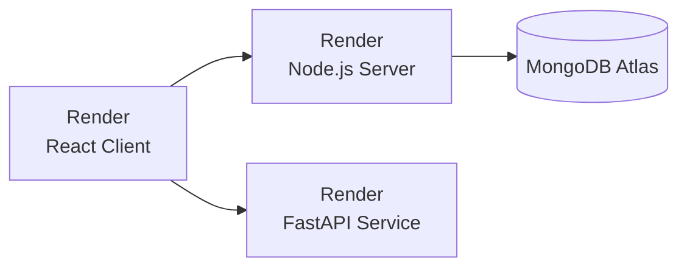

# PathGenie Full Deployment Guide (Render)

Deploy all three services of PathGenie on Render.

## Architecture Overview



| Service | Technology | Type on Render |
|---------|------------|----------------|
| **Client** | React + Vite | **Static Site** |
| **Server** | Node.js + Express | **Web Service** |
| **Resume Agent** | Python FastAPI | **Web Service** |

---

## Prerequisites

- GitHub repository: `TheIchigoSimp/HackNova_Hackathon`
- [MongoDB Atlas](https://www.mongodb.com/atlas) account
- [Render](https://render.com) account

---

## Step 1: Set Up MongoDB Atlas

1. Go to [MongoDB Atlas](https://www.mongodb.com/atlas) and create a free cluster
2. Create a database user with password
3. Whitelist all IPs (`0.0.0.0/0`)
4. Get your connection string:
   ```
   mongodb+srv://<username>:<password>@cluster0.xxxxx.mongodb.net/<dbname>?retryWrites=true&w=majority
   ```

---

## Step 2: Deploy the React Client (Static Site)

### 2.1 Create Static Site

1. Go to [Render Dashboard](https://dashboard.render.com)
2. Click **"New +"** → **"Static Site"**
3. Connect your GitHub repo: `HackNova_Hackathon`

### 2.2 Configure

| Setting | Value |
|---------|-------|
| **Name** | `pathgenie-client` |
| **Root Directory** | `client` |
| **Build Command** | `npm install && npm run build` |
| **Publish Directory** | `dist` |

### 2.3 Environment Variables

| Variable | Value |
|----------|-------|
| `VITE_MODE` | `production` |
| `VITE_SERVER_URL` | `https://pathgenie-server.onrender.com` |
| `VITE_RESUME_SERVICE_URL` | `https://pathgenie-resume.onrender.com` |

### 2.4 Deploy

Click **"Create Static Site"**.

**Your URL**: `https://pathgenie-client.onrender.com`

---

## Step 3: Deploy the Node.js Server (Web Service)

### 3.1 Create Web Service

1. Click **"New +"** → **"Web Service"**
2. Connect the same GitHub repo

### 3.2 Configure

| Setting | Value |
|---------|-------|
| **Name** | `pathgenie-server` |
| **Root Directory** | `server` |
| **Environment** | `Node` |
| **Build Command** | `npm install` |
| **Start Command** | `node index.js` |
| **Instance Type** | Free |

### 3.3 Environment Variables

| Variable | Value |
|----------|-------|
| `MONGODB_URI` | Your MongoDB Atlas connection string |
| `GROQ_API_KEY` | Your Groq API key |
| `BETTER_AUTH_SECRET` | A secure random string (32+ chars) |
| `CLIENT_URL` | `https://pathgenie-client.onrender.com` |
| `NODE_ENV` | `production` |

Click **"Create Web Service"**.

**Your URL**: `https://pathgenie-server.onrender.com`

---

## Step 4: Deploy the FastAPI Service (Web Service)

### 4.1 Create Web Service

1. Click **"New +"** → **"Web Service"**
2. Connect the same GitHub repo

### 4.2 Configure

| Setting | Value |
|---------|-------|
| **Name** | `pathgenie-resume` |
| **Root Directory** | `resume_agent_service` |
| **Environment** | `Python 3` |
| **Build Command** | `pip install -r requirements.txt` |
| **Start Command** | `uvicorn app.main:app --host 0.0.0.0 --port $PORT` |
| **Instance Type** | Free |

### 4.3 Environment Variables

| Variable | Value |
|----------|-------|
| `GROQ_API_KEY` | Your Groq API key |
| `OPENAI_API_KEY` | (optional) Your OpenAI key |
| `ENVIRONMENT` | `production` |

Click **"Create Web Service"**.

**Your URL**: `https://pathgenie-resume.onrender.com`

---

## Step 5: Update Environment Variables

After all services are deployed, update the client's env vars with actual URLs:

1. Go to **pathgenie-client** → **Environment**
2. Update:
   - `VITE_SERVER_URL` = actual server URL
   - `VITE_RESUME_SERVICE_URL` = actual resume service URL
3. Click **"Save Changes"** — triggers automatic redeploy

---

## Environment Variables Checklist

### Client (Static Site)
- [ ] `VITE_MODE=production`
- [ ] `VITE_SERVER_URL=https://pathgenie-server.onrender.com`
- [ ] `VITE_RESUME_SERVICE_URL=https://pathgenie-resume.onrender.com`

### Server (Web Service)
- [ ] `MONGODB_URI=mongodb+srv://...`
- [ ] `GROQ_API_KEY=gsk_...`
- [ ] `BETTER_AUTH_SECRET=...`
- [ ] `CLIENT_URL=https://pathgenie-client.onrender.com`
- [ ] `NODE_ENV=production`

### Resume Service (Web Service)
- [ ] `GROQ_API_KEY=gsk_...`
- [ ] `OPENAI_API_KEY=sk-...` (if needed)
- [ ] `ENVIRONMENT=production`

---

## Troubleshooting

| Issue | Solution |
|-------|----------|
| **CORS errors** | Add client URL to CORS origins in `server/index.js` |
| **MongoDB fails** | Whitelist `0.0.0.0/0` in Atlas |
| **Slow first load** | Free tier spins down after 15min inactivity |
| **Build fails** | Check Root Directory is set correctly |

---

## Cost (All on Render)

| Service | Free Tier | Paid |
|---------|-----------|------|
| Static Site | Unlimited | — |
| Web Service (×2) | 750 hrs/month total | $7/month each |
| **Total** | **Free** | ~$14/month |

---

## Quick Reference

- **Client**: `https://pathgenie-client.onrender.com`
- **Server**: `https://pathgenie-server.onrender.com`
- **Resume**: `https://pathgenie-resume.onrender.com`
