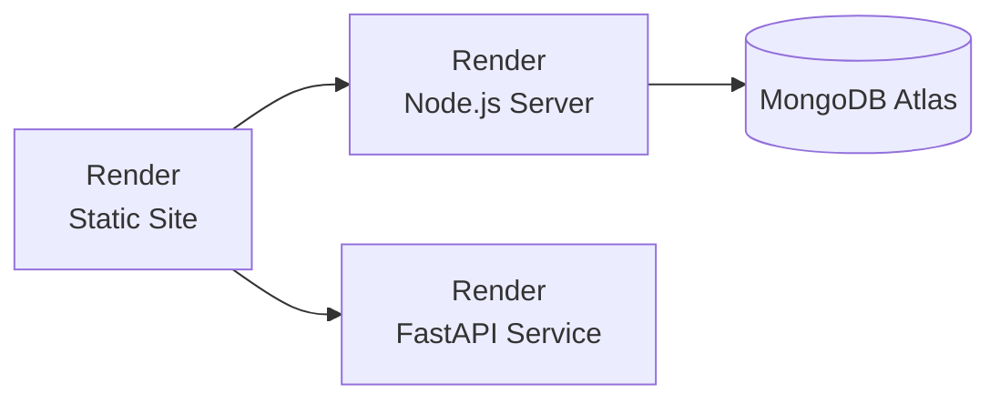

# PathGenie Deployment Guide (Render)

Deploy all three services on **Render.com**.

## Architecture



---

## Prerequisites

- GitHub repo connected to Render
- [MongoDB Atlas](https://www.mongodb.com/atlas) cluster (free tier works)

---

## Step 1: MongoDB Atlas Setup

1. Create free cluster at [MongoDB Atlas](https://cloud.mongodb.com)
2. Create database user with password
3. Whitelist IP: `0.0.0.0/0`
4. Copy connection string: `mongodb+srv://<user>:<pass>@cluster.xxxxx.mongodb.net/<db>`

---

## Step 2: Deploy React Client (Static Site)

1. **Render Dashboard** → **New +** → **Static Site**
2. Connect your GitHub repository

| Setting | Value |
|---------|-------|
| **Name** | `pathgenie-client` |
| **Root Directory** | `client` |
| **Build Command** | `npm install && npm run build` |
| **Publish Directory** | `dist` |

### Environment Variables

| Variable | Value |
|----------|-------|
| `VITE_MODE` | `production` |
| `VITE_SERVER_URL` | `https://pathgenie-server.onrender.com` |
| `VITE_RESUME_SERVICE_URL` | `https://pathgenie-resume.onrender.com` |

---

## Step 3: Deploy Node.js Server (Web Service)

1. **Render Dashboard** → **New +** → **Web Service**
2. Connect same repository

| Setting | Value |
|---------|-------|
| **Name** | `pathgenie-server` |
| **Root Directory** | `server` |
| **Environment** | `Node` |
| **Build Command** | `npm install` |
| **Start Command** | `node index.js` |

### Environment Variables

| Variable | Value |
|----------|-------|
| `MONGODB_URI` | Your MongoDB Atlas connection string |
| `GROQ_API_KEY` | Your Groq API key |
| `BETTER_AUTH_SECRET` | Random 32+ character secret |
| `CLIENT_URL` | `https://pathgenie-client.onrender.com` |
| `NODE_ENV` | `production` |

---

## Step 4: Deploy FastAPI Service (Web Service)

1. **Render Dashboard** → **New +** → **Web Service**
2. Connect same repository

| Setting | Value |
|---------|-------|
| **Name** | `pathgenie-resume` |
| **Root Directory** | `resume_agent_service` |
| **Environment** | `Python 3` |
| **Build Command** | `pip install -r requirements.txt` |
| **Start Command** | `uvicorn app.main:app --host 0.0.0.0 --port $PORT` |

### Environment Variables

| Variable | Value |
|----------|-------|
| `GROQ_API_KEY` | Your Groq API key |
| `ENVIRONMENT` | `production` |

---

## Step 5: Update CORS

In `server/index.js`, add your Render client URL:

```javascript
app.use(cors({
  origin: [
    'http://localhost:5173',
    'https://pathgenie-client.onrender.com'
  ],
  credentials: true
}));
```

---

## Environment Checklist

### Client (Static Site)
- [ ] `VITE_MODE=production`
- [ ] `VITE_SERVER_URL=https://pathgenie-server.onrender.com`
- [ ] `VITE_RESUME_SERVICE_URL=https://pathgenie-resume.onrender.com`

### Server (Web Service)
- [ ] `MONGODB_URI=mongodb+srv://...`
- [ ] `GROQ_API_KEY=gsk_...`
- [ ] `BETTER_AUTH_SECRET=...`
- [ ] `CLIENT_URL=https://pathgenie-client.onrender.com`
- [ ] `NODE_ENV=production`

### Resume Service (Web Service)
- [ ] `GROQ_API_KEY=gsk_...`
- [ ] `ENVIRONMENT=production`

---

## Troubleshooting

| Issue | Solution |
|-------|----------|
| **CORS Errors** | Add client URL to server CORS origins |
| **MongoDB Failed** | Whitelist `0.0.0.0/0` in Atlas |
| **Slow First Load** | Free tier spins down after 15min inactivity. Upgrade to $7/month for always-on |
| **Old Assets Showing** | Clear cache: Render → Deploy → Manual Deploy → "Clear build cache" |

---

## Final URLs

- **Client**: `https://pathgenie-client.onrender.com`
- **Server**: `https://pathgenie-server.onrender.com`
- **Resume Service**: `https://pathgenie-resume.onrender.com`
